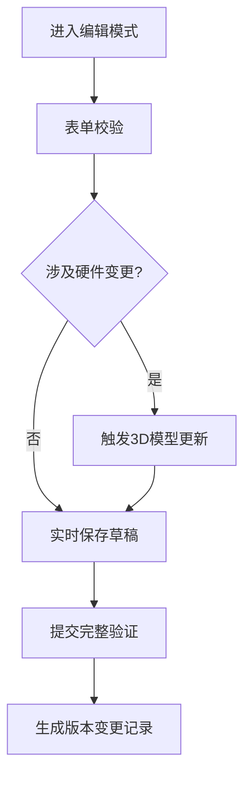

# 光学模块管理系统 UI/UX 设计规范

## 一、全局设计规范
1. **设计系统**：基于 Ant Design 5.x 扩展
2. **主题配置**：
   - 主色：#1890ff（科技蓝）
   - 辅色：#13c2c2（青蓝）
   - 危险色：#ff4d4f
   - 字体：14px 常规 / 16px 标题
3. **布局规范**：
   - 栅格系统：24 列响应式布局
   - 间距系统：8px 基准单位
   - 容器圆角：4px

## 二、核心页面结构

### 1. 光模块列表页
**布局结构**：
```jsx
<PageLayout>
  <FilterBar />
  <ActionBar>
    <BulkActions />
    <CreateButton />
  </ActionBar>
  <DataTable />
  <Pagination />
</PageLayout>
```

**组件说明**：
1. **FilterBar**（顶部筛选栏）
   - 组合式筛选组件
   - 包含：级联选择器（生命周期状态+封装类型）
   - 快速搜索框（支持编码/厂家模糊搜索）
   - 高级筛选抽屉（展开后显示复合条件）

2. **DataTable**（主数据表格）
   - 列配置：
     - 编码（固定首列）
     - 封装类型（带图标标识）
     - 最大速率（带颜色标记）
     - 温度范围（可视化温度条）
     - 发货状态（带状态点）
     - 操作列（查看/编辑/删除）
   - 交互：
     - 行点击展开详情侧边栏
     - 列头支持排序
     - 拖拽调整列宽

### 2. 光模块详情页
**布局结构**：
```jsx
<DetailLayout>
  <HeaderSection>
    <3DPreview />
    <BasicInfoPanel />
  </HeaderSection>
  <TabContainer>
    <SpecTab />
    <ManufacturingTab />
    <HistoryTimeline />
  </TabContainer>
</DetailLayout>
```

**核心组件**：
1. **3DPreview**（三维可视化区）
   - 使用 Three.js 实现
   - 功能：
     - 360° 旋转查看
     - 组件拆解视图（LD/PD/TIA 高亮）
     - 热力图显示温度分布
   - 控制栏：
     - 视图切换按钮
     - 缩放滑块
     - 复位视角

2. **SpecPanel**（参数配置面板）
   - 分组折叠面板设计：
     ```jsx
     <Collapse>
       <PerformanceSpecs />
       <EnvironmentalSpecs />
       <ShipmentInfo />
     </Collapse>
     ```
   - 特色组件：
     - 范围输入（温度/功耗）：双滑块组件
     - 速率集：标签式多选输入
     - 光纤类型：可视化光纤截面选择器

3. **HistoryTimeline**（操作时间轴）
   - 垂直时间线布局
   - 支持按类型过滤
   - 操作详情展开浮层
   - 支持添加备注附件

## 三、复杂交互流程

### 1. 参数配置工作流


### 2. 批量操作流程
- **多选模式**：
  - Shift+Click 连续选择
  - Ctrl+Click 离散选择
- **批量操作栏**：
  - 状态批量变更
  - 导出选中项
  - 生成对比报告

## 四、3D 视图规范
1. **渲染区域**：1280x720 画布
2. **性能优化**：
   - LOD（Levels of Detail）分级加载
   - WebGL 2.0 渲染管线
   - 异步加载模型资源
3. **交互事件**：
   - 组件点击高亮
   - 右键上下文菜单
   - 滚轮缩放灵敏度：0.1x

## 五、异常处理设计
1. **数据加载**：
   - 骨架屏占位（列表/详情）
   - 局部加载指示器
   - 错误回退+重试机制

2. **表单验证**：
   - 实时字段校验
   - 温度范围交叉验证
   - 厂家-型号关联校验

## 六、响应式方案
| 断点        | 布局策略                     |
|-------------|----------------------------|
| < 768px     | 垂直堆叠+抽屉导航           |
| 768-1200px  | 两栏布局+浮动操作栏         |
| > 1200px    | 三栏布局+固定侧边栏         |

## 七、组件开发规范
1. **状态管理**：
   ```javascript
   // Redux store 结构
   {
     modules: {
       list: [],
       current: {
         specs: {},
         history: [],
         _3dState: {}
       },
       filters: {}
     }
   }
   ```

2. **性能优化**：
   - 虚拟滚动（列表页）
   - 请求防抖（筛选操作）
   - 模型缓存（3D 资源）

附：设计系统组件对应表
| AntD 组件    | 定制扩展点               |
|--------------|-------------------------|
| Table        | 温度可视化列            |
| Form         | 关联字段联动逻辑        |
| Timeline     | 可交互操作节点          |
| Collapse     | 带版本对比的面板头      |